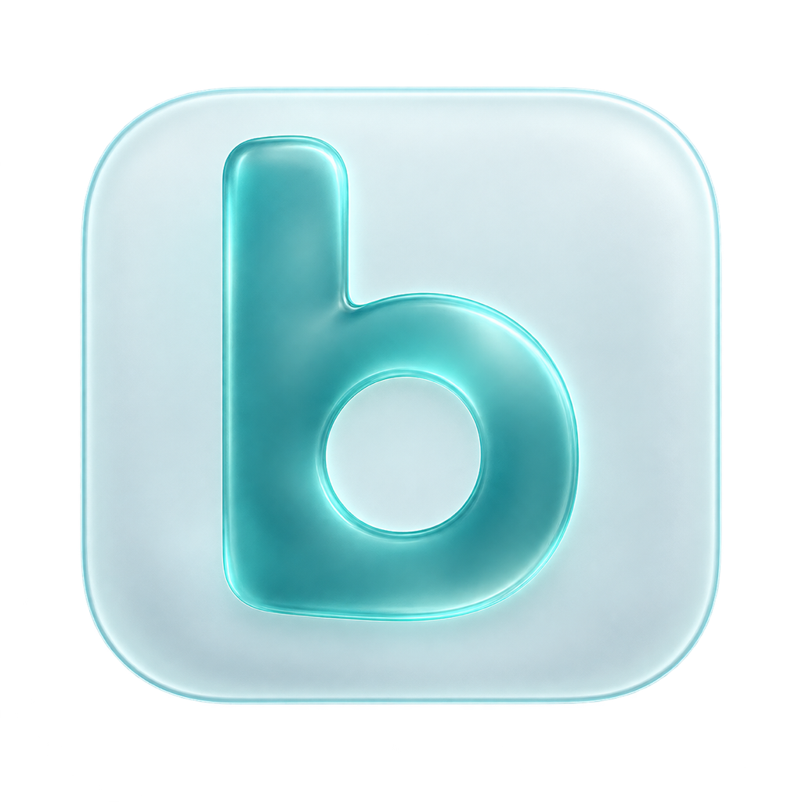
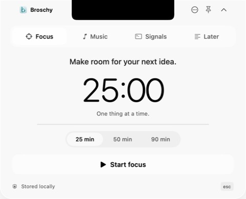
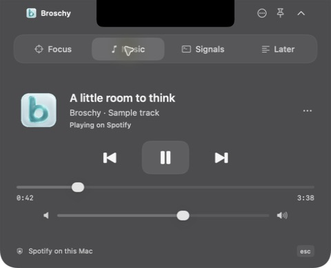
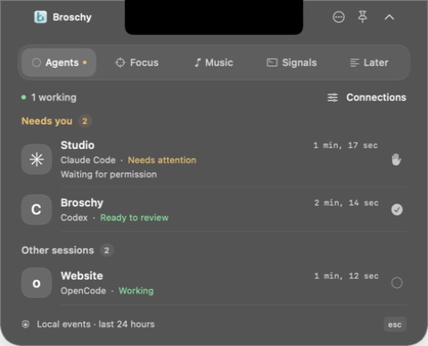

<p align="center">
  
</p>

<h1 align="center">Broschy</h1>

<p align="center"><strong>A little more life around your notch.</strong><br>
Agents, focus, music, command results, and quick notes — one glance away.</p>

<p align="center">
  <a href="https://github.com/SculptTechProject/Broschy/actions/workflows/ci.yml"></a>
  
  
  <a href="LICENSE"></a>
</p>

<p align="center"><a href="#get-started">Get started</a> · <a href="#agents">Agents</a> · <a href="#spotify">Spotify</a> · <a href="#terminal-signals">Terminal signals</a> · <a href="CONTRIBUTING.md">Contribute</a></p>

Broschy is a small, native macOS companion that lives around your MacBook's notch. Hover to open it, take care of something, and get back to your work. A translucent compact strip keeps the essentials visible without opening a full window.

<table>
  <tr>
    <td></td>
    <td></td>
  </tr>
  <tr><td align="center">A moment to focus.</td><td align="center">Your music, within reach.</td></tr>
</table>

<p align="center"><sub>Actual app views with sample data. Glass adapts to your appearance and the content behind it.</sub></p>

## Five things, close at hand

| | What it does |
| :--- | :--- |
| **Agents** | Monitor local Codex, Claude Code, and OpenCode sessions. See who is working, waiting for you, or ready for review. |
| **Focus** | Keep one task in view. Start a 25, 50, or 90-minute session, pause it, and pick up where you left off. The timer accounts for sleep. |
| **Music** | See the current Spotify track and artwork. Play, pause, skip, seek, and adjust Spotify's volume. The compact view keeps the title, artist, elapsed time, and animated playback bars nearby. |
| **Signals** | Run a build or test through the bundled CLI and see when it finishes. Success, failure, and cancellation appear in the panel. |
| **Later** | Capture a thought or your next step in a quick note that saves automatically. |

### Made for the edge of your screen

- **Liquid Glass, expanded and compact.** Native glass on macOS 26, with a standard macOS material on earlier versions.
- **Light and Dark, automatically.** Text, accents, and surfaces follow the system appearance, including Auto.
- **Motion with a purpose.** Smooth open/close transitions and small playback indicators; Reduce Motion and Reduce Transparency are respected.
- **One place to look.** Agent attention comes first; active focus sessions, recent command results, and working agents also take priority over music in the compact view.
- **Native and small.** SwiftUI, AppKit, a bundled CLI, and no third-party Swift dependencies. English throughout.

## Get started

**Current version: 0.7.1.** Broschy is an early, source-first release. Build it locally with **Xcode 26 or later** and its macOS SDK. The app's deployment target is **macOS 14**; hands-on validation has been on macOS 26 and Apple Silicon. The build produces an app for your Mac's architecture.

```sh
git clone https://github.com/SculptTechProject/Broschy.git
cd Broschy
bash build.sh
open build/Broschy.app
```

The build script assembles `build/Broschy.app` and signs it locally with an ad hoc signature. It does not install the app in Applications. There is currently no notarized public download or App Store build.

### Open, hide, and quit

| Action | How |
| :--- | :--- |
| Open the panel | Hover over the notch or click the compact strip |
| Toggle the panel | **Control + Option + N**, or the menu bar icon |
| Keep it open | Click the pin |
| Hide it | **Esc** or the chevron in the panel |
| Quit Broschy | **⋯ → Quit Broschy**, the menu bar menu, or **Command + Q** while the panel has focus |

Hiding the panel keeps Broschy running. To reopen it after quitting, launch `Broschy.app`. Broschy has no Dock icon and does not automatically start at login. On a screen without a notch, it appears at the center of the top edge.

## Agents

<p align="center"><br><sub>Sample sessions in Dark appearance.</sub></p>

Open **Agents → Connections** to connect Codex, Claude Code, or OpenCode. Restart the connected tool; Codex may require you to review the new hooks with `/hooks`. Sessions appear when they send an event.

The **Needs you** queue gathers questions, permission requests, responses ready for review, and errors. The compact notch signals activity without opening a full window. Session actions let you copy a terminal resume command, open the project folder, and mark a response reviewed.

This is a local monitor for supported CLI hooks and plugins: it does not open transcripts or store prompts, tool arguments, or output. It does not send prompts, approve tools, or stop agents. The Codex desktop app is not currently a verified integration. Activity is checked against the originating process when available; stale activity becomes “Status unknown” instead of staying “Working”. “Ready to review” means a response stopped, not that the task necessarily succeeded. Setup needs Python 3. See the [integration guide](docs/AGENTS.md) for compatibility, configuration, removal, and limitations.

## Spotify

1. Open the **Spotify desktop app** on your Mac.
2. In Broschy, choose **Music → Connect Spotify**.
3. Allow Broschy to control Spotify when macOS asks.

That's it. No Spotify API key, developer account, or login inside Broschy is needed. If no track is selected, choose one in Spotify first.

The connection uses local Apple Events. **⋯ → Disconnect Spotify** stops monitoring without stopping your music. If access was denied, use **Open Settings**, then allow the app under **Privacy & Security → Automation**. macOS may list an existing installation under its previous name, NotchFlow.

Playback bars indicate whether music is playing; they do not analyze audio or use the microphone. Spotify volume is separate from system volume. Browser playback, music search, and choosing a Spotify Connect device are not supported.

## Terminal signals

From the repository directory:

```sh
# Run a command and show its result in Broschy.
./build/Broschy.app/Contents/MacOS/broschy-cli run --label "Build" -- swift build

# Run Broschy's own checks.
./build/Broschy.app/Contents/MacOS/broschy-cli run --label "Tests" -- bash test.sh

# Send a result from your own script.
./build/Broschy.app/Contents/MacOS/broschy-cli notify --title "Ready to review" --status succeeded
```

You can also use **Signals → Copy command** for an example with the correct path to your copy of the app. The CLI forwards the command's input/output and exit status. Arguments are executed directly; pass a shell explicitly if you need a pipeline.

Broschy sees commands you run through its CLI and results you explicitly send. It does not inspect other terminal sessions, IDEs, or cloud CI services. Control + C records cancellation; a forced kill or shutdown can leave a command marked Running. Cancellation is forwarded to the direct child process.

## Your data stays on your Mac

The task, timer, note, and command history are stored locally. Broschy has no account, analytics, or cloud sync. Agent snapshots contain session and project identifiers, status, generic activity labels, and timestamps; prompts and tool contents are not saved. Integration setup retains local configuration backups. Command records contain a label, working directory, status, timestamps, and an exit code when available; command arguments and output are not saved. Album artwork is fetched over HTTPS from URLs returned by Spotify. No listening history or Spotify tokens are stored.

For compatibility with earlier installations, the storage folder remains:

```text
~/Library/Application Support/NotchFlow/
├── state.json
├── jobs/
└── agents/
```

Use **Open Broschy Data** from the menu bar to find it. The legacy bundle identifier is also retained so existing preferences and macOS permissions keep the same application identity. See [development notes](docs/DEVELOPMENT.md) for details.

## Development

```sh
bash test.sh   # Isolated core, agent bridge, installer, and mocked Spotify checks
bash build.sh  # Release app bundle, icon, and local signature
```

Tests use temporary data and mocked Spotify responses. They do not control your player. UI appearance, physical notch placement, and macOS Automation prompts still need manual checks. See [development notes](docs/DEVELOPMENT.md), [design notes](DESIGN.md), and [contributing](CONTRIBUTING.md).

Multi-display setups, Stage Manager, full-screen apps, and an auto-hidden menu bar need broader device testing. These are the main areas where feedback is useful.

## License

[MIT](LICENSE) · Built by [SculptTechProject](https://github.com/SculptTechProject).

An independent project, not affiliated with Apple or Spotify.
